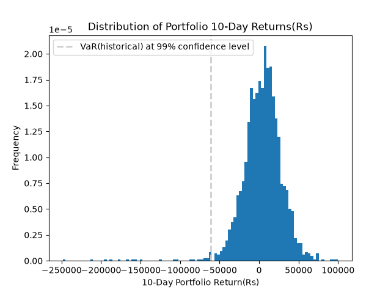

# Historical Value-at-Risk (VaR) Framework

A Python-based portfolio risk analysis engine that calculates **Historical Value at Risk (VaR)** and validates it using a **Rolling Backtest**. Built for the Indian equity market using NSE-listed stocks.

---

##  Objective

This project is built to quantify the **maximum expected loss** of an equally-weighted equity portfolio over a given time horizon at a specified confidence level — using the **Historical Simulation method** of VaR.

This project also includes a **backtesting module through breach rate** to validate the accuracy of the VaR model by measuring how often actual losses exceeded the predicted VaR.

---

## What is Value at Risk (VaR)?

Value at Risk is a statistical measure that estimates the worst expected loss over a defined period, under normal market conditions, at a given confidence level.

> A 1-day VaR of ₹50,000 at 95% confidence means there is only a 5% chance the portfolio loses more than ₹50,000 in a single day.

### Historical Simulation Method

Unlike parametric VaR (which assumes a normal distribution), **Historical Simulation** uses actual past returns to estimate risk. It makes no assumptions about the return distribution — it simply observes what has happened historically.


## Formula Used
This project follows these formulas for parameters necessary for VaR historical calculations:

#### Log Returns
$$r_t = \ln\left(\frac{P_t}{P_{t-1}}\right)$$

#### Portfolio Return (Equally Weighted)
$$R_{portfolio} = \sum_{i=1}^{n} w_i \cdot r_i \quad \text{where } w_i = \frac{1}{n}$$

#### X-Day Portfolio Return
$$R_{x\text{-day}} = \sum_{t=1}^{x} R_{portfolio,t}$$

#### Historical VaR
$$\text{VaR}_{1-\alpha} = -\text{Percentile}(R_{x\text{-day}},\ (1-c) \times 100) \times \text{Portfolio Value}$$

Where:
- $c$ = confidence level (e.g. 0.95)
- $\alpha$ = significance level = $1 - c$

#### Backtest — Breach Rate
$$\text{Breach Rate} = \frac{\text{Number of Breaches}}{\text{Total Observations}} \times 100$$

A well-calibrated model at 95% confidence should have a breach rate close to **5%**.

---

## 🛠️ Tools & Libraries Used

| Tool | Purpose |
|---|---|
| `Python 3.10+` | Core language |
| `yfinance` | Downloading historical stock price data from Yahoo Finance |
| `pandas` | Data manipulation and time series handling |
| `numpy` | Numerical operations, log returns, percentile calculation |
| `matplotlib` | Visualisations — histogram, cumulative returns |
| `datetime` | Generating dynamic date ranges for data download |

---


## 🚀 Getting Started

### 1. Clone the repository
```bash
git clone https://github.com/Ayushi828/-Historical-VaR-Framework
cd Historical-VaR-Framework
```

### 2. Install dependencies
```bash
pip install -r requirements.txt
```

### 3. Install the package in editable mode
```bash
pip install -e .
```

### 4. Run the main notebook
Open `notebooks/main.ipynb` in Jupyter or VS Code and run all cells.

---

## 🖥️ User Interactive Feature

One of the highlights of this project is its **interactive input system**. When you run `main.ipynb`, the programme prompts you to enter:

| Input | Description | 
|---|---|
| `Years` | How many years of historical data to use ||
| `Portfolio Value` | Total value of your portfolio in ₹ |
| `Days` | Time horizon for VaR (1-day, 5-day, etc.) | 
| `Confidence Level` | Statistical confidence interval in decimal|

This means the same codebase can calculate VaR for any portfolio size, any time horizon, and any confidence level just by entering different values at runtime. It is helpful in comparing:
- 1-day VaR vs 5-day VaR
- 95% confidence vs 99% confidence
- ₹5,00,000 portfolio vs ₹50,00,000 portfolio

---

## 📊 Visualisations 

### VaR Result (Output)
```

The VaR calculated through historical simulation for your portfolio of value Rs 650,500.00 is 61,400.42
At 99.0% confidence,  the portfolio of Rs 650,500.00 will not lose more than ₹61,400.42 in 10 day.
The Risk is Rs 9.44% of total portfolio value of 650500.0


-------------------- Breach Test --------------------
Total Observations: 2208
Breaches: 52
Expected Breaches: 22.08
Breach Rate is 2.36% of total observation in given dataset.
```

---

### Plot - Distribution of Portfolio Returns (Histogram) and VaR 



The histogram shows the full distribution of x-day portfolio returns. The  dashed line marks the VaR threshold — returns to the left of this line represent the tail risk.

---


## 📦 Requirements

```
yfinance
pandas
numpy
matplotlib
datetime
ipykernel
jupyter
setuptools
```

Install all at once:
```bash
pip install -r requirements.txt
```

---

## 📌 Notes

- Portfolio is **equally weighted** by default. To use custom weights, modify the `weight` array in `main.ipynb`.
- Tickers are NSE-listed Indian stocks, to change the portfolio, edit `data/ticker_list.py`.
- The backtest uses a **250-day rolling window** (approximately 1 trading year for Indian Stock Market, it can be different depending on the stock exchange).

---

## 👤 Author

**Ayushi**
